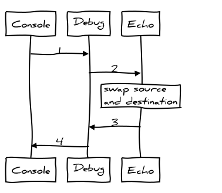
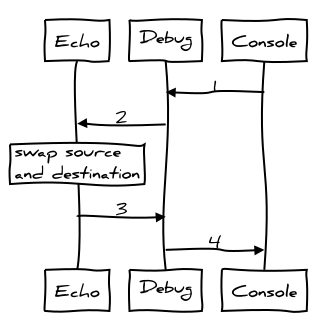

.. BFR Debug Element

.. highlight:: xml

Debugging
=========

This section contains configuration components that can be used to better understand the way 
BACnet packets are processed by the BFR.  By "splicing" debugging components in different 
sections of the stack the user can see how packets are transformed.

Debug
-----

The ``Debug`` component prints the contents of the packets it receives to ``stdout`` and 
then continues the packet in the same direction it came from, upstream or downstream::

    <Debug client="client_label" server="server_label" prefix="prefix_str" />

This component can act as a client, server, or both at the same time.  When it is in the 
middle of a stack, both the ``client`` and ``server`` attributes are specified.  If the 
``prefix`` is provided, the prefix string is printed before the packet contents providing a 
way to distinguish different debugging sections and layers.

There is no restriction on the number of debugging components in a configuration.

Console
-------

The ``Console`` component ::

    <Console client="client_label" server="server_label" prefix="prefix_str" />

This component can act as a client or a server, but not both at the same time.  There can
be only one console component in a configuration.

Echo
----

The ``Echo`` component receives any packet, swaps the source and destination, and 
sends the packet back::

    <Echo client="client_label" server="server_label" />

This component can act as a client or server, but not both at the same time.  There is 
no restriction on the number of echo components in a configuration.

Samples
-------

For these and other samples, the components are described in configuration starting from 
the bottom of a stack and proceeding up.  In the coorisponding diagrams, upstream traffic 
goes from left to right, the downstream traffic from right to left.

Console as a Server
~~~~~~~~~~~~~~~~~~~

This sample configuration file creates one of each of the ``Console``, ``Debug``, and ``Echo``
components and binds them together::

    <BFR>
        <Console server="a"/>
        <Debug client="a" server="b"/>
        <Echo client="b"/>
    </BFR>

    *Console as a Server*

.. js-sequence-diagram
    Console->Debug: 1
    Debug->Echo: 2
    Note over Echo: swap source\nand destination
    Echo->Debug: 3
    Debug->Console: 4

Packets entered at the console are sent *upstream* to the debug component which prints a description of the 
packet and forwards it to the echo component.  The echo swaps the source and destination addresses and sends 
the packet *downstream*.

Console as a Client
~~~~~~~~~~~~~~~~~~~

This configuration file is almost identical to the one above, except the stack is flipped::

    <BFR>
        <Echo server="a"/>
        <Debug client="a" server="b"/>
        <Console client="b"/>
    </BFR>

    *Console as a Client*

.. js-sequence-diagram
    participant Echo
    participant Debug
    participant Console
    Console->Debug: 1
    Debug->Echo: 2
    Note over Echo: swap source\nand destination
    Echo->Debug: 3
    Debug->Console: 4

Packets entered at the console are sent *downstream* to the debug component which prints a description of the 
packet and forwards it to the echo component.  The echo swaps the source and destination addresses and sends 
the packet *upstream*.

