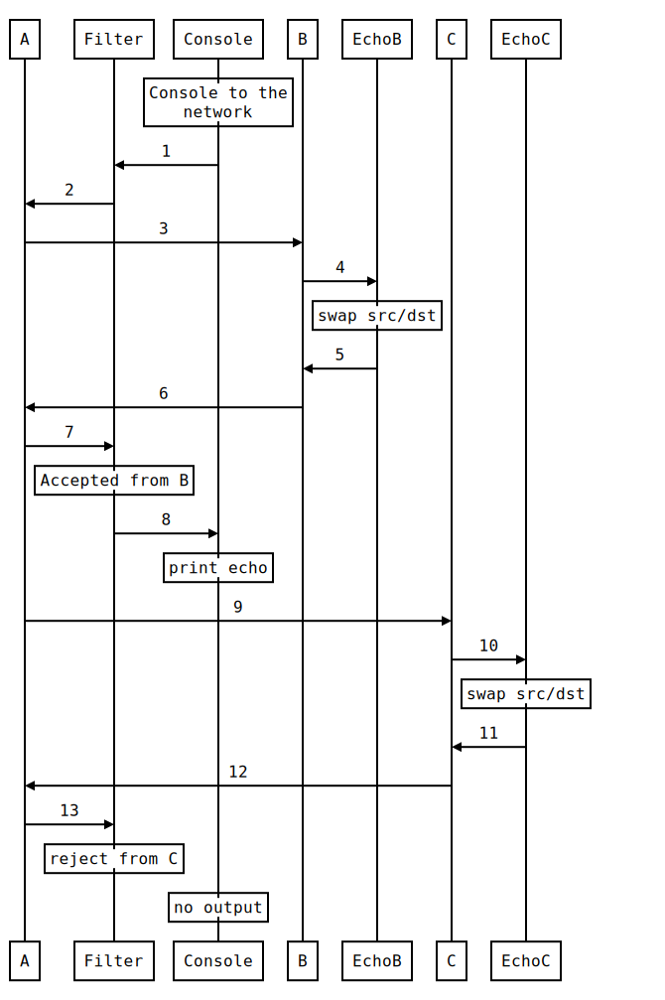

.. BFR Filter Element

.. highlight:: xml

Filtering Packets
=================

This is a long line of text.

Filter
------

The Filter component creates a mechanism for "deep inspection" upstream and/or downstream packets 
and allowing them to be accepted or rejected::

    <Filter client="client_label" server="server_label">
        <Upstream>
            <Accept source="source_address" destination="destination_address" function="function" />
            <Reject />
        </Upstream>

        <Downstream>
            ...same accept or reject components as upstream...
        </Downstream>

    </Filter>

The ``Upstream`` and ``Downstream`` components are optional and may be specified in any order, but 
each my only be specified once as a child of the ``Fitler`` component.

The ``Upstream`` and ``Downstream`` components have the same ``Accept`` and ``Reject`` children with 
the same semantics.

Accept and Reject
~~~~~~~~~~~~~~~~~

The ``Accept`` and ``Reject`` components have identical attributes; ``source``, ``destination``, 
and ``function``.  If any or all of these are provided, the coorisponding value is considered a match 
when the packet value is identical.  For example::

    <Accept source="12" />

This filter element matches and accepts all packets whose source address is ``12``, independent of 
the destination address or the function.  All other packets are passed to the next filter 
element.

.. note:: The filter elements are processed in the order they are specified.

An element where all attributes are not specified will function as a universal match.  For example::

    <Reject />

This filter will reject all packets, no further filtering will be performed.

Address Filters
~~~~~~~~~~~~~~~

The ``source`` and ``destination`` address attributes may be any one of the follow forms:

=======  =========================================
String   Matches
=======  =========================================
``:``    Any local station
``*``    Local broadcast address
``*:``   Any remote station
``n``    Local station address ``n``
``n:``   Any remote station on network ``n``
``n:*``  Remote broadcast address on network ``n``
``*:*``  Global broadcast address
=======  =========================================

The correct form of address to use will depend on the layer where the filter is applied.  For example, 
a remote address, remote broadcast, and global broadcast are not meanful filtering packets going to 
or from a local network.

Function Filters
~~~~~~~~~~~~~~~~

The ``function`` filter attributes may be one or more of the keywords in the following tables.  More than 
one keyword can be specified, separated by blanks.

BACnet/IP Message Types
'''''''''''''''''''''''

    BVLC-RESULT, 
    WRITE-BROADCAST-DISTRIBUTION-TABLE, WRITE-BDT, 
    READ-BROADCAST-DISTRIBUTION-TABLE, READ-BDT, 
    READ-BROADCAST-DISTRIBUTION-TABLE-ACK, READ-BDT-ACK, 
    FORWARDED-NPDU, REGISTER-FOREIGN-DEVICE, READ-FOREIGN-DEVICE-TABLE, 
    READ-FDT, READ-FOREIGN-DEVICE-TABLE-ACK, READ-FDT-ACK, 
    DELETE-FOREIGN-DEVICE-TABLE-ENTRY, DELETE-FDT-ENTRY, 
    DISTRIBUTE-BROADCAST-TO-NETWORK, ORIGINAL-UNICAST-NPDU, ORIGINAL-BROADCAST-NPDU

Network Layer Message Types
'''''''''''''''''''''''''''

    WHO-IS-ROUTER-TO-NETWORK, WHOS-RTN, I-AM-ROUTER-TO-NETWORK, IM-RTN, 
    I-COULD-BE-ROUTER-TO-NETWORK, I-CLD-BE-RTN, REJECT-MESSAGE-TO-NETWORK, 
    REJ-MTN, ROUTER-BUSY-TO-NETWORK, RBTN, ROUTER-AVAILABLE-TO-NETWORK, 
    RATN, INITIALIZE-ROUTING-TABLE, IRT, INITIALIZE-ROUTING-TABLE-ACK, 
    IRT-ACK, ESTABLISH-CONNECTION-TO-NETWORK, ECTN, 
    DISCONNECT-CONNECTION-TO-NETWORK, DCTN

Application Layer Message Types
'''''''''''''''''''''''''''''''

    CONFIRMED-REQUEST, UNCONFIRMED-REQUEST, SIMPLEACK, COMPLEXACK, 
    SEGMENTACK, ERROR, REJECT, ABORT

Application Layer Confirmed Services
''''''''''''''''''''''''''''''''''''

    ACKNOWLEDGEALARM, CONFIRMEDCOVNOTIFICATION, CONFIRMEDEVENTNOTIFICATION, 
    GETALARMSUMMARY, GETENROLLMENTSUMMARY, SUBSCRIBECOV, ATOMICREADFILE, 
    ATOMICWRITEFILE, ADDLISTELEMENT, REMOVELISTELEMENT, CREATEOBJECT, 
    DELETEOBJECT, READPROPERTY, READPROPERTYCONDITIONAL, READPROPERTYMULTIPLE, 
    WRITEPROPERTY, WRITEPROPERTYMULTIPLE, DEVICECOMMUNICATIONCONTROL, 
    CONFIRMEDPRIVATETRANSFER, CONFIRMEDTEXTMESSAGE, REINITIALIZEDEVICE, 
    VTOPEN, VTCLOSE, VTDATA, AUTHENTICATE, REQUESTKEY, READRANGE, 
    GETEVENTINFORMATION

Application Layer Unconfirmed Services
''''''''''''''''''''''''''''''''''''''

    I-AM, I-HAVE, UNCONFIRMEDCOVNOTIFICATION, UNCONFIRMEDEVENTNOTIFICATION, 
    UNCONFIRMEDPRIVATETRANSFER, UNCONFIRMEDTEXTMESSAGE, TIMESYNCHRONIZATION, 
    WHO-HAS, WHO-IS, UTCTIMESYNCHRONIZATION

Samples
-------

For these and other samples, the components are described in configuration starting from 
the bottom of a stack and proceeding up.  In the coorisponding diagrams, upstream traffic 
goes from left to right, the downstream traffic from right to left.

VLAN Filter
~~~~~~~~~~~

This sample configuration file creates a virtual network with three nodes::

    <BFR>
        Create a network with three nodes:

        <VLAN>
            <Node address="1" server="a" />
            <Node address="2" server="b" />
            <Node address="3" server="c" />
        </VLAN>

        On the first node, bind a filter:

        <Filter client="a" server="ax">

            Filter upstream traffic from the node to the console, accepting 
            traffic from address "2" but rejecting everything else:

            <Upstream>
                <Accept source="2" />
                <Reject />
            </Upstream>

            No downstream filtering.

            <Downstream />
        </Filter>

        And then bind a console:

        <Console client="ax" />

        On the second node, bind a echo:

        <Echo client="b" />

        On the third node, bind another echo:

        <Echo client="c" />
    </BFR>

    *VLAN Filter*

.. http://bramp.github.io/js-sequence-diagrams/
    participant A
    participant Filter
    participant Console
    participant B
    participant EchoB
    participant C
    participant EchoC

    Note over Console: Console to the\n network
    Console->Filter: 1
    Filter->A: 2

    A->B: 3
    B->EchoB: 4
    Note over EchoB: swap src/dst
    EchoB->B: 5
    B->A: 6
    A->Filter: 7
    Note over Filter: Accepted from B
    Filter->Console: 8
    Note over Console: print echo
    A->C: 9
    C->EchoC: 10
    Note over EchoC: swap src/dst
    EchoC->C: 11
    C->A: 12
    A->Filter: 13
    Note over Filter: reject from C
    Note over Console: no output

In this sequence, the user enters a broadcast message on the console, such as this::

    * 01020304

The packet travels downstream from the console to the filter (1).  There is no filtering on 
downstream packets, so it continues downstream to the VLAN node (2).

Node ``A`` recognises that it is a broadcast message and that it should be distributed to 
all of the other nodes in the VLAN, so it provides a copy of the message to ``B`` (3) and 
another copy to ``C`` (9).

Node ``B`` sends its copy of the packet upstream to the ``Echo`` component (4) which swaps 
the source and destination and sends it back downstream (5).  Node ``B`` recognises that it 
is a unicast message and sends it to ``A`` (6).  Node ``A`` sends the packet upstream to the 
filter (7).

The filter receives the upstream packet, matches it against the rules in the ``Upstream`` 
sub-component of its configuration.  The packet is accepted, then forwarded upstream to the 
console (8), which then prints the packet.

Node ``C`` receives the packet from ``A`` (9), sends it upstream to the ``Echo`` component (10) 
which swaps the source and destination and sends it back downstream (11).  Node ``C`` 
recognises that it is a unicast message and sends it to ``A`` (12).

The filter receives the upstream packet, matches it against the rules in the ``Upstream`` 
sub-component of its configuration.  The packet is rejected.

