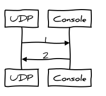

.. BFR Network Element

.. highlight:: xml

Networking
==========

Network elements allow one to configure the BFR to make use of a network 
connection to send and receive packets that are on a network.  Making full use of these 
configuration elements may require the process running the BFR to have root (administrator) 
access to the machine to be able to set the network card into promiscuous mode so that 
it may "see" packets that are not originally destined for the machine with the BFR loaded.

Ethernet
--------

The ``Ethernet`` element provides access to BACnet/Ethernet packets, 802.3 messages with 
a service access point 0x82::

    <Ethernet server="server_label" device="device_str" promiscuous="flag" />

The ``device`` is the name of the Ethernet adapter as listed in the /dev directory of 
devices. Usually this is eth0 or eth1.

The ``promiscuous`` may be "y" or "Y" and specifies that the adapter be put into "promiscuous" 
mode.  Typically an Ethernet adapter will only pass packets to the operating system that are 
directed specifically its address or broadcast packets. When in promiscuous mode, the BFR 
receives all of the packets on the network segment and may monitor or filter them. It may 
also "spoof" other devices by sending out packets with the source address different than its own.

Not all Ethernet adapters and/or drivers support promiscuous mode.

UDP
---

The UDP element provides access to a UDP port::

    <UDP server="server_label" address="address_str" />

The ``address`` is of the form *X.X.X.X/Y:Z*, where *X.X.X.X* is the IP address bound to 
an adapter in the dot-quad notation, *Y* is the number of bits in the network portion, and *Z* 
is the port number.

If the */Y* portion of the address is omitted, the socket will not receive broadcast packets.

If the *:Z* portion of the address is omitted, the port will default to 47808 (0xBAC0).

.. note:: Dealing with multi-link multi-homing using the regular socket library is painful 
    and error prone. Having more than one adapter with a different address on the same IP subnet 
    and/or sitting on the same LAN has not been well tested. Multiple UDP elements with different 
    port numbers (like 47808 and 47809) on the same network and multiple elements with different 
    IP addresses on different networks works fine. Promiscuous IP is not available.

Samples
-------

For these and other samples, the components are described in configuration starting from 
the bottom of a stack and proceeding up.  In the coorisponding diagrams, upstream traffic 
goes from left to right, the downstream traffic from right to left.

UDP to Console
~~~~~~~~~~~~~~

This sample configuration file creates one of the ``UDP`` and ``Console`` 
components and binds them together::

    <BFR>
        <UDP address="192.168.1.1/24" server="lan" />
        <Console client="lan" />
    </BFR>

    *UDP to Console*

.. js-sequence-diagram
    UDP->Console: 1
    Console->UDP: 2

Packets arriving over the network are sent upstream to the console, and packets entered at the console
are sent on the network.

With the address given in the configuration the BFR will create two UDP (datagram) sockets, one for 
unicast traffic which will be bound to 192.168.1.1, and the other for receiving broadcast traffic which 
will be bound to 192.168.1.255.

For packets the BFR receives on the unicast port, the source will be the original source IP address and 
socket and the destination will be the port.  For broadcast packets, the BFR will receive the broadcast 
packet on the broadcast port and show the destination as the local broadcast address "*".

UDP Address Environment Value
~~~~~~~~~~~~~~~~~~~~~~~~~~~~~

This sample configuration file is identical to the one above, except that it references an environment 
variable to get the address::

    <BFR>
        <UDP address="$BFR_ETH0_ADDRESS" server="lan" />
        <Console client="lan" />
    </BFR>

.. highlight:: bash

The BFR can now be executed like this::

    $ export BFR_ETH0_ADDRESS=192.168.1.1/24
    $ ./BFR config.bfr

Or by setting the value on the same script line::

    $ BFR_ETH0_ADDRESS=192.168.1.1/24 ./BFR config.bfr

