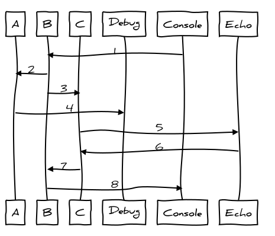

.. BFR VLAN

.. highlight:: xml

VLAN
====

*Virtual Local Area Network* elements are used to replace physical networking components 
to facilitate testing network configurations where a physical connection to a network is 
not available or inconvenient.

VLANs can be configured to create a network with any arbitrary MAC address size, so they 
can be used to simulate smaller networks such as ARCNET that has one octet address, or 
larger networks such as Ethernet or IP.  These simulations are restricted to supporting 
unicast and broadcast messages, more sophisticated simlulations of multicast address or 
IP routers performing NAT may be added in the future.

.. _VLAN:

VLAN
----

The VLAN component creates a virtual network with a collection of connection nodes, or 
stations.  Each node has a unique address::

    <VLAN>
        <Node address="node_address" server="server_label" promiscuous="flag" />
        ...additional nodes...
    </VLAN>

Each child ``Node`` component is a connection to the network.  All traffic being sent on 
the network will have the ``node_address`` as a source address.

The ``promiscuous`` flag is "y" or "Y" if the node listens for all traffic on the VLAN, 
and may also "spoof" other devices by including both a source and destination address.

Samples
-------

For these and other samples, the components are described in configuration starting from 
the bottom of a stack and proceeding up.  In the coorisponding diagrams, upstream traffic 
goes from left to right, the downstream traffic from right to left.

VLAN Echo
~~~~~~~~~

This sample configuration file creates a virtual network with three nodes::

    <BFR>
        Create a network with three nodes:

        <VLAN>
            <Node address="1" server="a" promiscuous="y" />
            <Node address="2" server="b" />
            <Node address="3" server="c" />
        </VLAN>

        On the first node, bind a debugger:

        <Debug client="a" prefix="a" />

        On the second node, bind a console:

        <Console client="b" />

        On the third node, bind an echo:

        <Echo client="c" />
    </BFR>

    *VLAN Echo*

.. js-sequence-diagram
    participant A
    participant B
    participant C
    participant Debug
    participant Console
    participant Echo
    Console->B: 1
    B->A: 2
    B->C: 3
    A->Debug: 4
    C->Echo: 5
    Echo->C: 6
    C->B: 7
    B->Console: 8

In this sequence, the user enters a broadcast message on the console, such as this::

    * 01020304

The message travels downstream from the console to node ``B`` (1).  The node recognizes recognises 
that it should be distributed to all of the other nodes in the VLAN, so it provides a copy 
of the message to ``A`` (2) and an additional copy to ``C`` (3).  These two messages, number (2) 
and (3) are between two peers, so they are not strictly upstream or downstream messages.

The node ``A`` sends the packet upstream to the ``Debug`` component (4) which prints the message 
to ``stdout``.

The node ``C`` sends its copy of the packet upstream to the ``Echo`` component (5).  The ``Echo``
component swaps the source and desination address and send it back down to ``C`` (6).  Then ``C`` 
recognises the destination address for ``B`` and sends the packet to it (7).

The node ``B`` receives the packet and sends it upstream to the console, which prints the packet.

.. note:: The node ``A`` at address ``1`` is set as *promiscuous* so it will receive a copy of 
    every packet on the network, including those sent from ``C`` to ``B``.  So in addition to the 
    debugging messages that are in the stream of packets on other nodes, node ``A`` will print 
    out the contents of every message on the LAN.

